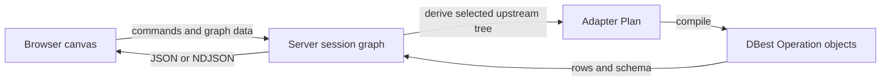

# DBest

DBest is a local web application for building relational data operations on a visual canvas. Add a table, connect operations such as filters, projections, joins, aggregations, and set operations, then inspect or export the result of any node.

The application can work with in-memory tables and imported CSV, XML, or B-tree-backed tables.

## From canvas to result

The browser edits a directed graph of table and operator nodes. It sends commands and typed JSON payloads to the local server rather than creating DBest engine objects directly. The server maintains the
editable graph, derives an adapter Plan tree for the selected node, and compiles that tree into DBest Operation objects only when performing schema lookup or execution



The graph may be incomplete while it is being edited. Only a node with all required upstream inputs can become an executable plan. The server reports graph and engine-level problems separately from editing commands, so the canvas can retain unfinished work.

## Components

- `app/client` is the React/Vite browser client. It renders the canvas and forms, decodes server responses defensively, and streams or pages result rows.
- `app/server` is the Kotlin application. It owns workspaces, graph history, persistence, HTTP routes, table handles, the plan adapter, and the single execution queue.
- `modules/engine` is the Java DBest engine. Its `Operation` classes and table implementations perform the actual relational work.
- `Makefile` is the intended top-level interface for local setup, running, testing, and building.

## Run locally

Prerequisites: JDK 17 and Node.js 22 (the versions used in CI). From a clean clone:

```bash
make setup
make run
```

`make run` builds the client, packages it into the server resources, and starts the integrated application on the loopback interface at `http://localhost:8000` by default. Set `PORT` to choose a different port.

Useful commands:

```bash
make test-unit       # JVM suites and client unit tests
make test-contract   # client protocol against a self-booted backend
make test-e2e        # Playwright browser health suite
make verify          # unit + contract + client lint/build/format check
make build           # app/server/build/libs/dbest-0.1.0-SNAPSHOT.jar
```

The browser suite needs Playwright's Chromium browser. CI installs it with `cd app/client && npx playwright install --with-deps chromium`; on a development machine, install Chromium with Playwright using the command appropriate for the operating system before `make test-e2e`.

## Testing

- JVM tests in `app/server/test` cover HTTP behavior, graph/history rules, persistence, adapter behavior, ingestion, and export. `modules/engine` is included in Gradle's `check` lifecycle.
- Client unit tests in `app/client/tests/unit` cover protocol decoders and client-side graph, form, and UI utilities.
- Contract tests start the bundled server JAR and exercise the routes and operator catalog consumed by the client.
- Playwright health tests start the backend and Vite, assemble representative canvas graphs through the UI, and check rendered results.

`make verify` deliberately excludes the browser suite; run `make test-e2e` when browser coverage is required.

## Repository structure

```text
app/
  client/       React canvas, forms, result viewer, protocol decoders, tests
  server/       Kotlin HTTP application, workspace state, graph-to-plan adapter
modules/
  engine/       Java DBest tables, indexes, and relational Operation classes
docs/
  architecture.md  Runtime boundaries, lifecycle, and pressure points
  development.md   Setup, test, build, and troubleshooting details
  adr/             Decisions about the two query representations
```

## Status

DBest is in active `0.x` development. Session files, the HTTP representation, the editor graph, and the adapter plan may change before `1.0`.

## Further reading

- [Architecture reference](docs/architecture.md)
- [Architecture contracts](docs/architecture/README.md)
- [Development](docs/development.md)
- [Command reference](docs/commands.md)
- [Kotlin unorthodoxies](docs/unorthodoxies.md)
- [ADR 0001: Separate the editor graph from the executable plan](docs/adr/0001-editor-graph-and-executable-plan.md)
- [ADR 0002: Compile adapter plans at the engine boundary](docs/adr/0002-compile-plans-at-engine-boundary.md)
