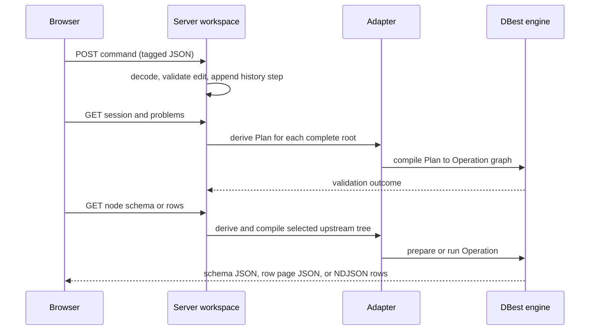

# Architecture

This is the end-to-end architecture reference. Focused, code-linked contracts are organized by runtime boundary in [architecture/](architecture/README.md): editor graph, plan/engine boundary, runtime ownership, HTTP API, persistence, and operator extension.

## System overview

DBest is a loopback HTTP application with three runtime layers:

- The React client renders and edits a canvas. It holds transient UI state such as selection, dialogs, clipboard contents, and the last decoded server view.
- The Kotlin server owns durable-in-process workspace state and turns a selected canvas node into a query. It also serves the built client assets.
- The Java engine owns table implementations and executable relational `Operation` objects.

The browser is not an execution client. It sends a command such as `addNode`, `connect`, or `setNode` to the server, then reloads the server's `SessionView` and current problems. The server is the authority for graph edits and query execution.

## Query lifecycle

An edge runs from a producer to a consumer. A consumer has explicit input ports: none for a table node, `ONLY` for a unary node, and `LEFT` plus `RIGHT` for a binary node. A root is a graph sink—there is no outgoing edge from it. Running any node derives the tree consisting of that node and its upstream inputs; downstream nodes are irrelevant to that request.

`Session` contains four serializable collections:

- `tables`: `TableId` to a declarative `TableSpec`;
- `nodes`: `NodeId` to a `Node` payload;
- `edges`: producer/consumer/port connections; and
- `layout`: canvas positions.

The browser and server exchange this model as tagged JSON. The server reconstructs it from edit commands and persists it with undo/redo history in a `.dbest` session file. Open engine tables are intentionally not serialized.

For a node request, `app/server/src/features/canvas/query/Query.kt` walks incoming edges recursively and converts each `Node` into the corresponding `kernel.adapter.Plan` value. A `TableNode` resolves its `TableId` through the workspace's lazily opened table-handle map. Unary and binary nodes attach the recursively derived input plans. That plan is then compiled recursively into the engine's `ibd.query.Operation` graph and either prepared, run, or streamed.

## Representations and their invariants

| Representation                           | Role                                                 | Contains                                                                            | Can represent                                                     |
| ---------------------------------------- | ---------------------------------------------------- | ----------------------------------------------------------------------------------- | ----------------------------------------------------------------- |
| Editor graph (`Session`, `Node`, `Edge`) | Editable and persistable canvas document             | Node configuration, table specifications, connections, layout, history              | Disconnected nodes, missing inputs, and several independent roots |
| Adapter `Plan`                           | Derived executable description for one selected node | Recursive inputs, conditions/operator settings, and resolved `TableHandle`s         | A complete upstream tree only                                     |
| DBest `Operation` graph                  | Engine runtime object model                          | Mutable engine operation instances, engine lookup filters, table objects, iterators | An operation ready for `prepareAllDataSources()` or `run()`       |

### What `Node` means

`Node` is a sealed server-side description of one canvas operator, not a general engine node. Its subtype declares the operator's parameters and arity: for example, `FilterNode` carries a `Condition`, `JoinNode` carries equality terms/type/algorithm, and `TableNode` carries a `TableId` plus source alias. Inputs are deliberately not fields on `Node`; `Edge` records them so the same node payload has an independent visual position and graph connectivity.

Node constructors enforce local parameter rules such as non-empty projection lists, positive limits, or required join terms. Command application adds document rules: IDs must exist, a table cannot be removed while scanned, each input port has at most one edge, and a new edge cannot create a cycle. It does **not** require all input ports to be connected. That is what permits an unfinished node on the canvas.

### What `Plan` means

`Plan` is a sealed hierarchy of Kotlin data classes in `app/server/src/kernel/adapter/Plan.kt`. A plan turns graph connectivity into nested structure: `Filter(input, condition)`, `Join(left, right, ...)`, and so on. It repeats local invariant checks because it is also usable outside the canvas feature.

It is structurally immutable, which lets schema lookup, validation, and execution consume the same value independently. It is not a portable pure data-transfer object: its `Table` leaf holds a `TableHandle`, which wraps an opened engine `Table`. The serializable table description lives only in `TableSpec` on the editor side of the boundary.

The editor must not construct engine objects directly. It needs unfinished, serializable, undoable graph state and table IDs, whereas DBest needs resolved tables and a complete tree of inputs. The cost is intentional duplication of operator shape and parameters across `Node`, `Plan`, the conversion function, the palette catalog, and captions.

### Validation and schema inference

Validation is staged rather than a single parse-time event:

1. JSON decoding and `Node` construction reject malformed wire data and local invalid parameters.
2. Applying a command validates graph/document invariants, including ports and cycles.
3. `GET /problems` marks missing inputs on every node. For each root whose upstream subtree has no missing input, it derives a plan, compiles it, calls `Operation.run()`, and closes the operation in all cases. Errors are reported against the root. The result iterator is not drained, so this is engine-backed validation/initialization rather than a full result scan.
4. Actual schema and row requests compile again. A row request can therefore still fail even if a prior problem check passed.

Schema is inferred on demand, primarily for forms and result display. `schema(plan)` compiles the plan, calls `prepareAllDataSources()`, and converts the engine's exposed data sources to `SchemaColumn` values. Set-operation compilation also asks for both input schemas to check column counts. Schema is cached by `Plan` in a process-global map.

## Engine boundary

`compile(plan)` is a recursive adapter, not an object interpreter in the usual sense. It does not keep a `Plan` around and dispatch on it while DBest executes. Instead, it materializes a new DBest object graph: for example, a `Filter` becomes `ibd.query.unaryop.filter.Filter`, a `Project` becomes `Projection`, and a `Join` selects a concrete nested-loop, hash, or merge join class. Conditions become DBest lookup-filter objects, and adapter enums become the engine's constants or concrete classes.

After compilation, the engine object graph owns the operation-specific execution behavior. DBest's `Operation.run()` produces tuples and `Operation.close()` releases operation resources. The adapter converts tuples to maps keyed as `alias.column` before serializing them for the client.

## State, execution, and resources

Most editor state is replaced rather than mutated: `Session`, `History`, `CanvasState`, commands, nodes, and plans are data values. A workspace holds an `AtomicReference<CanvasState>`; command routes use compare-and-set to publish each new history state and increment its revision. Undo history is capped at 200 steps, with consecutive moves of the same node coalesced.

Mutable runtime state is deliberately separate:

- `Sessions.workspaces` maps session IDs to `Workspace` objects. A workspace owns its open-table map, current canvas reference, save path/name, and dirty flag.
- Table handles are opened lazily from `TableSpec` and reused within that workspace. Closing a session or the process closes and clears those handles.
- `Sessions.engine` has one worker thread and one admission permit for the entire server. A normal row request or stream fails quickly if another query is running; schema/problem checks wait. Thus a long engine request blocks engine work across all workspaces.
- Non-paged results compile, run, consume all tuples, and close the operation in a `finally` block. Unpaged HTTP results are produced through a bounded queue and support client cancellation.
- Paged results keep an engine operation and iterator in a process-global, access-ordered cache of at most eight `Plan` keys. A cursor is closed when exhausted, restarted, or evicted. This avoids replaying a query for forward pagination, but a backward offset restarts it.

## Current pressure points

The following are working boundaries with identifiable change cost.

**Operator metadata is distributed.** Adding or changing an operator commonly touches `Nodes.kt`, `Query.kt`, the plan/compiler, `Catalog.kt`, captions, wire codecs, and client form support. Contract and caption tests catch much of this, but the fields/forms are not derived from plan definitions. The current alias catalog illustrates the risk: its `from` field is presented as a column choice while the engine-side rename operation expects a source alias.

**Caches outlive a workspace.** Schema and page-cursor caches are process-global rather than workspace-owned. Schema inference closes its temporary operation, but the schema cache has no eviction or invalidation. Page cursors are bounded and normally closed, but session close only closes table handles; it does not explicitly purge cursor entries. These lifetimes make resource behavior depend on engine internals and server history rather than only on the active workspace.

**Execution is globally serialized.** The one-worker `Engine` gives a clear concurrency model and protects the current application from overlapping engine work, but it also means that a large export, stream, or validation path can delay otherwise unrelated sessions. Moving to per-workspace or concurrent execution would require auditing engine/table and cache safety first.

## Related decisions

- [ADR 0001: Separate the editor graph from the executable plan](adr/0001-editor-graph-and-executable-plan.md)
- [ADR 0002: Compile adapter plans at the engine boundary](adr/0002-compile-plans-at-engine-boundary.md)
