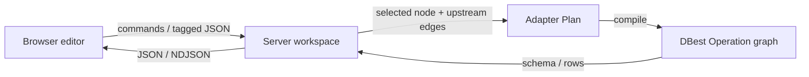

# System overview

DBest is a loopback web application for constructing relational operations on a canvas. The browser is an editor: it sends commands and tagged JSON data to the server. The server owns each workspace's editable document, derives an executable tree for a requested node, and compiles that tree to DBest objects immediately before engine work.

## Runtime boundaries

| Boundary | Responsibility | Main implementation |
| --- | --- | --- |
| Browser | UI-only state, defensive protocol decoding, requests and result rendering | [client API](../../app/client/src/server/api.ts), [client protocol decoder](../../app/client/src/server/protocol.ts) |
| Server workspace | Editable canvas, history, session metadata, table-handle ownership | [sessions](../../app/server/src/features/sessions/Sessions.kt), [canvas routes](../../app/server/src/features/canvas/CanvasRoutes.kt) |
| Adapter | Plan invariants, graph-to-plan derivation, DBest compilation, schema/row conversion | [Plan](../../app/server/src/kernel/adapter/Plan.kt), [query derivation](../../app/server/src/features/canvas/query/Query.kt), [compiler](../../app/server/src/kernel/adapter/compile/Compiler.kt) |
| DBest engine | Opened tables, concrete `Operation` objects, iterators, and execution lifecycle | [`modules/engine`](../../modules/engine) |

The server is authoritative for edits and execution. After a command, the browser receives an acknowledgement and reloads the `SessionView` and problems; it does not synthesize a new authoritative graph locally. See [the HTTP API contract](http-api.md).

## Request lifecycle

An edge leads from a producer to a consumer. When a client asks for schema, rows, or export of node `N`, the server reads the current session, follows only edges that lead into `N`, resolves table specifications to workspace-owned handles, and produces a `Plan`. Nodes downstream from `N` are irrelevant to that request.

Schema lookup and execution each compile a fresh engine operation graph. The worker queue serializes engine work for the whole process. Details, including the difference between paged and streamed rows, belong in [runtime ownership](runtime-ownership.md).

## Documentation map

The documents in this directory are contracts, not duplicate API references. They say what a caller may rely on and link to the code that enforces it:

- [Editor graph](editor-graph.md): valid and incomplete document states, commands, undo/redo, and revision behavior.
- [Plan and engine boundary](plan-engine.md): the three query representations, their conversion, and their lifecycle.
- [Runtime ownership](runtime-ownership.md): mutable resources and concurrency.
- [HTTP API contract](http-api.md): routes, tagged JSON, result formats, errors, and authentication.
- [Persistence](persistence.md): durable session contents and versioning.
- [Operator extension](operator-extension.md): the distributed operator contract and tests that protect it.
